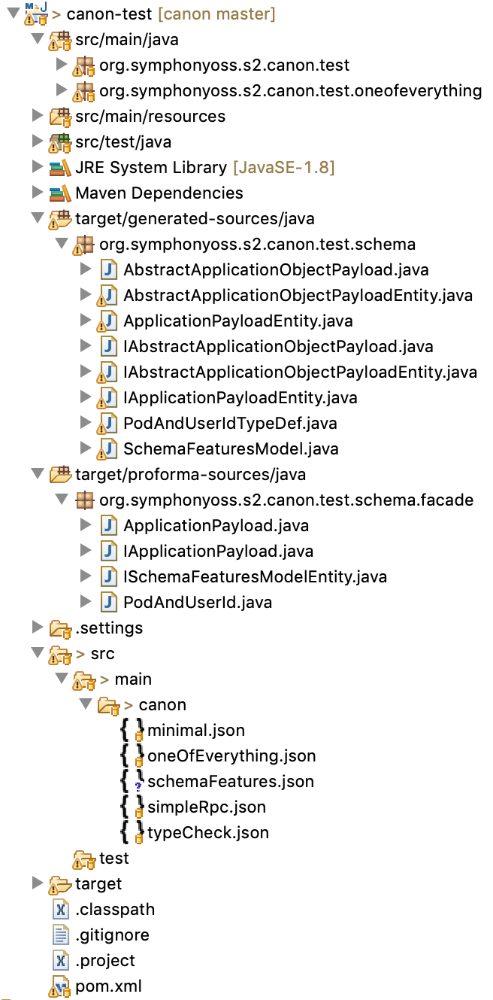

# Canon Java Code Generation

The image below shows part of the file structure of the Canon Test module, which is part of the Canon
project:



Canon schema files are located in **src/main/canon** and the generated code is written to
**target/generated-sources/java**. Proforma sources for facade classes are written to
**target/proforma-sources/java** and may be copied to **src/main/java** if the class does
not exist a generation time as a developer convenience.

## Canon Maven Plugin

The following partial POM snippets show how the Canon Maven plugin is configured.

Several properties are defined to be referred to later, the template coordinates define which code
generation is to be performed (at this time Java is the only option).

```xml
  <properties>
    <canon.version>0.2.14</canon.version>
    <canon.template.groupid>org.symphonyoss.s2.canon</canon.template.groupid>
    <canon.template.java>canon-template-java</canon.template.java>
    <canon.template.version>${canon.version}</canon.template.version>
  </properties>
  ```
 The **pluginManagement** section ensures that the correct version of the Canon maven plugin
 is selected.
  
  ```xml
  <build>
    <pluginManagement>
      <plugins>
        <plugin>
          <groupId>org.symphonyoss.s2.canon</groupId>
          <artifactId>canon-maven-plugin</artifactId>
          <version>${canon.version}</version>
        </plugin>
      </plugins>
    </pluginManagement>
  ```
 This snippet binds the plugin to the **generate-sources** build phase.
  
  ```xml
    <plugins>
      <plugin>
        <groupId>org.symphonyoss.s2.canon</groupId>
        <artifactId>canon-maven-plugin</artifactId>
        <executions>
          <execution>
            <phase>generate-sources</phase>
            <goals>
              <goal>generate-sources</goal>
            </goals>
  ```
The **srcDirs** attribute tells the plugin where to look for Canon schema sources, and
the **proformaCopyDir** attribute allows you to specify a directory into which proforma facade
classes will be copied _if they do not already exist_. The plugin will never overwrite a file in
this directory to avoid the possibility of destroying hand written code. The proforma is always
written to **target/proforma-sources/java** and can be copied from there if changes to the model require
a facade to be updated. This configuration option is a convenience to avoid a manual step
each time a new object which has a facade defined is added to a model.
  
  ```xml
            <configuration>
              <srcDirs>src/main/canon</srcDirs>
              <proformaCopyDir>src/main</proformaCopyDir>
  ```
In some cases it is desirable to link to other models in the same Maven project, referring
to them by their public URL. If updates are made to both models in a single development cycle
it would normally be necessary to commit the schema changes to the public source code repository
in order for the project to build. This my result in multiple incomplete commits being
exposed to external consumer of the schema during a development cycle.

One way to avoid this is to refer to the models using a relative URL, but this means that
3rd party users of the schemas cannot build them since the relative path is always interpreted
from the source path of the root project being built.

An alternative method of achieving the desired outcome is to provide one or more **urlMapping**s
which tell the Canon maven plugin to replace occurences with a given absolute URL with
an alternative relative URL:
  
  ```xml
              <uriMapping>
                <property>
                 <name>https://models.oss.symphony.com/core.json</name>
                 <value>../../../../core-model/src/main/canon/core.json</value>
                </property>
                <property>
                 <name>https://models.oss.symphony.com/crypto.json</name>
                 <value>../../../../crypto-model/src/main/canon/crypto.json</value>
                </property>
              </uriMapping>
  ```
The **templateArtifacts** section is where the template resources defined in properties earlier
are actually bound to the build:
  
  ```xml
              <templateArtifacts>
                <templateArtifact>
                  <groupId>${canon.template.groupid}</groupId>
                  <artifactId>${canon.template.java}</artifactId>
                  <version>${canon.template.version}</version>
                </templateArtifact>
              </templateArtifacts>
            </configuration>
          </execution>
        </executions>
      </plugin>
```

Finally the **build-helper-maven-plugin** can be used to add the **target/generated-sources/java**
directory to the Maven build path.
  
```xml
      <plugin>
        <groupId>org.codehaus.mojo</groupId>
        <artifactId>build-helper-maven-plugin</artifactId>
        <executions>
          <execution>
            <id>add-source</id>
            <phase>generate-sources</phase>
            <goals>
              <goal>add-source</goal>
            </goals>
            <configuration>
              <sources>
                <source>target/generated-sources/java</source>
              </sources>
            </configuration>
          </execution>
        </executions>
      </plugin>
    </plugins>
  </build>
```